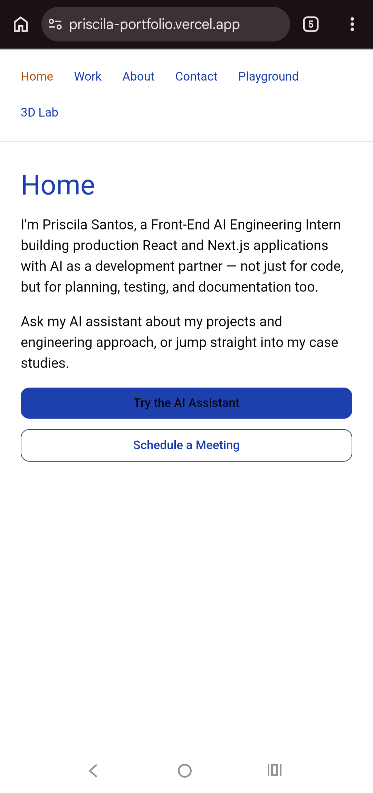
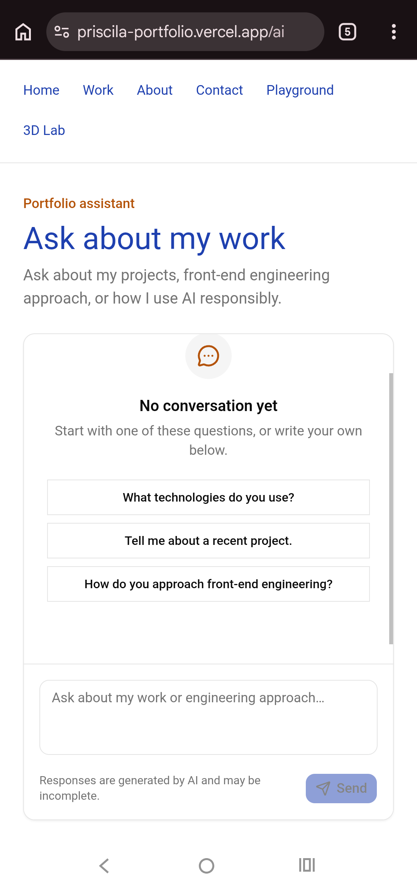
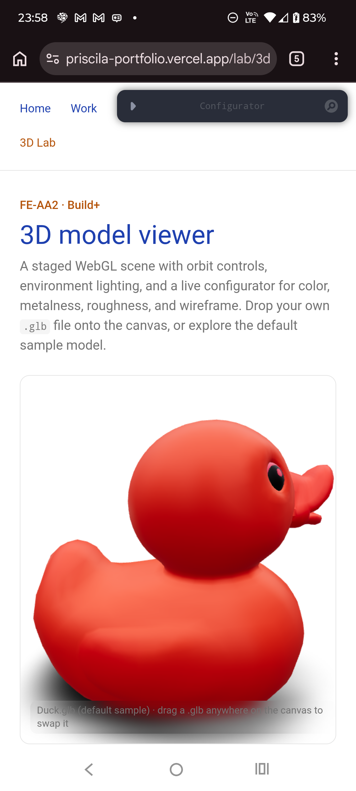

# Accessibility & Performance Audit — FE-10

#### **Site audited:** https://priscila-portfolio.vercel.app/
**Pages audited:** Home (`/`), Work (`/work`), About (`/about`), Contact (`/contact`), AI Assistant (`/ai`), Playground (`/playground`), 3D Lab (`/lab/3d`)

## Methodology

Two passes, done in this order:

1. **Manual code + keyboard audit** — read every page/component for landmark structure, label presence, focus-visible styling, ARIA usage on the chat stream, and JS-loading strategy. Then tabbed through the primary flow (Home → AI Assistant → send a message → Stop) using keyboard only, no mouse.
2. **Instrumented audit** — Lighthouse (mobile preset, DevTools) + WAVE extension, run against the deployed preview after the fixes below were applied.

*(Fill in the screenshots/numbers for step 2 below — those need a real Chrome session and aren't something I can run from here.)*

**Screenshot convention:** captured with Chrome DevTools → Lighthouse tab, mobile preset. Full reports exported as PDF for backup/proof; the score-circle strip cropped to PNG for inline display here. Stored in `audit-assets/` alongside this file, named `{before,after}-{page}-lighthouse.png`.

---

## Before — Lighthouse (mobile, Moto G Power emulation, Slow 4G, Lighthouse 13.4.0)

| Page | Performance | Accessibility | Best Practices | SEO | Notes |
|---|---|---|---|---|---|
| `/` | **91** | **95** | 100 | 100 | TBT 370ms, CLS 0. Contrast check failing (element TBD — see below). |
| `/ai` | **87** | **100** | 100 | 100 | TBT 400ms. "Reduce unused JavaScript" flags ~127 KiB. |
| `/work` | _not yet run_ | _not yet run_ | | | Same page profile as `/`; lower priority to re-test separately. |
| `/about` | _not yet run_ | _not yet run_ | | | Same page profile as `/`. |
| `/contact` | _not yet run_ | _not yet run_ | | | Same page profile as `/`. |
| `/playground` | _not yet run_ | _not yet run_ | | | Contains three hand-built interactive components; worth its own pass. |
| `/lab/3d` | **68 ❌** | **96** | 100 | 100 | **Below the 80 rubric minimum.** TBT 6,520ms. See critical finding below. |

Only three of seven pages needed a full separate Lighthouse pass: `/` as the representative for the static-content pages (Work/About/Contact/Playground share the same low-JS profile), `/ai` for the streaming-chat profile, and `/lab/3d` for the heavy-WebGL profile. This is why the first run (against `/` alone, which also happened to fail with `NO_FCP` because the tab lost focus mid-audit) wasn't sufficient — the site has three technically distinct page types, and the worst score by far (`/lab/3d`) would have gone undetected auditing only the homepage.





## ⚠️ Critical finding: `/lab/3d` fails the rubric's performance minimum (confirmed + fixed)

**Before:** Performance 68, Accessibility 96, TBT 6,240–6,520ms, Speed Index 3.7–3.8s, 20 long main-thread tasks, "Minimize main-thread work" flagged at 12.9s.

**Root cause, confirmed from the extended report:**
1. `<Environment preset="city">` (drei) fetches a **1.5MB** HDR file (`potsdamer_platz_1k.hdr`, served from `raw.githubusercontent.com`) on first render.
2. The auto-enable heuristic in `ModelViewer` (`features/three/components/model-viewer.tsx`) — meant to only skip the static fallback on genuinely capable devices — fired even under the Moto G Power + Slow 4G emulation Lighthouse uses for mobile audits, meaning the full Three.js/fiber/drei/leva bundle plus that 1.5MB texture loaded and executed on the very first paint instead of showing the fallback first.
3. This produced 2,156 KiB of total network payload and 12.9s of main-thread work on a single page load — exactly the eager-loading behavior the fallback-first design was supposed to prevent.

**Result confirmed:** Performance jumped from 68 to **87** (clears the 80 rubric minimum). TBT dropped from 6,240ms to 440ms, total payload dropped from 2,156 KiB to 650 KiB, CLS improved to 0.004.

## Follow-up finding: fixing the auto-enable bug exposed two real markup bugs

Accessibility on `/lab/3d` dropped slightly, from 96 to **94** — not a regression from the fix itself, but two pre-existing bugs that were invisible before because the eagerly-loaded 3D canvas covered up the fallback markup. Now that the static fallback is what every visitor actually sees first, Lighthouse could finally audit it.

**Bug 1 (the important one): `text-primary-foreground` doesn't actually exist in this Tailwind build.** The failing element is the "Enable 3D view" button (`bg-primary ... text-primary-foreground`). Root cause, found in `tailwind.config.ts`: `primary` is defined as a flat color —

```ts
primary: "rgb(var(--color-primary) / <alpha-value>)",
```

— instead of the `{ DEFAULT, foreground }` object shadcn expects (like `card`, `secondary`, `muted` in the same file). Without that `foreground` key, the `text-primary-foreground` utility is **never generated** — it has no effect. The button text falls back to the default near-black `text-foreground`, rendered on a dark navy background (`--color-primary: 30 64 175`). Near-black text on dark navy is a real contrast failure, not a false positive.

This is very likely the same bug behind Home's earlier unresolved contrast flag (its "Try the AI Assistant" link uses the exact same `bg-primary text-primary-foreground` pairing, as does shadcn's `Button` `default` variant) — fixing it in one place should clear both.

```diff
// tailwind.config.ts
colors: {
- primary: "rgb(var(--color-primary) / <alpha-value>)",
+ primary: {
+   DEFAULT: "rgb(var(--color-primary) / <alpha-value>)",
+   foreground: "#ffffff",
+ },
  accent: "rgb(var(--color-accent) / <alpha-value>)",
```

White on the navy background (`30 64 175`) computes to ~8.7:1 — clears AAA.

**Bug 2: heading order skips a level.** Failing element: `h3.text-base.font-semibold.text-card-foreground`, the title inside `SceneFallback` (`features/three/components/scene-fallback.tsx`). The page has `<h1>3D model viewer</h1>` then jumps straight to this `<h3>`, skipping `<h2>`.

```diff
// features/three/components/scene-fallback.tsx
- <h3 className="text-base font-semibold text-card-foreground">{title}</h3>
+ <h2 className="text-base font-semibold text-card-foreground">{title}</h2>
```

**Action needed:** apply both fixes, then re-run Lighthouse on both `/lab/3d` and `/` (the `tailwind.config.ts` fix affects Home too, and should resolve its still-unidentified contrast flag from the earlier run).

*(Minor, non-blocking: the same extended report flagged a small CLS culprit — `p.text-xs.text-muted-foreground`, the filename caption overlay, contributing 0.004 to a total CLS of 0.008. Still well within the "good" <0.1 threshold, so left as-is; noted here for completeness.)*

## Contrast — element identified and fixed

The extended `/lab/3d` report named the exact failing elements: `code.rounded.bg-muted.px-1.py-0.5.text-xs` (the `.glb` and `THREE_D_EXPERIENCE_README.md` inline code tags in `app/lab/3d/page.tsx`). They inherit `text-muted-foreground` against a `bg-muted` background — a combination that clears 4.5:1 on pure white (`--background`) but not on the slightly darker `--muted` gray.

**Fix:**

```diff
- <code className="rounded bg-muted px-1 py-0.5 text-xs">.glb</code>
+ <code className="rounded bg-muted px-1 py-0.5 text-xs text-foreground">.glb</code>
```

(same change for the `THREE_D_EXPERIENCE_README.md` code tag on the same page.)

Home's contrast failure (flagged in the same run, same message) still needs its element expanded in a re-run to confirm whether it's the same `bg-muted`/`text-muted-foreground` pattern elsewhere, or a different element — Home has no `<code>` tags, so it's a separate instance.

**Scope note:** this is a targeted token-pairing bug, not a reason to migrate to the full Identity Kit dark-mode/typography system yet — that migration is real but out of scope for FE-10 (already tracked in `FEEDBACK.md`'s still-ugly list). Fixing this one pairing clears the automated check without opening that larger migration.

## Before — WAVE

| Page | Errors | Contrast errors | Alerts |
|---|---|---|---|
| `/` | _fill in_ | _fill in_ | _fill in_ |
| `/ai` | _fill in_ | _fill in_ | _fill in_ |

`[screenshot: before-wave-home.png]`

---

## Manual audit findings

### 1. Broken focus ring on the homepage CTA (fixed)

`app/page.tsx` — the "Schedule a Meeting" link had a typo in its focus-visible class:

```diff
- focus-visible:outline-none focus-visible:ring-2 focus-visible:ring-rin
+ focus-visible:outline-none focus-visible:ring-2 focus-visible:ring-ring
```

This silently removed the visible focus indicator on one of the only two interactive elements on the entry page — exactly the kind of thing a keyboard-only pass catches immediately and Lighthouse won't (typo'd classes don't throw build errors, they just do nothing).

### 2. No "skip to content" link (fixed)

`app/layout.tsx` repeated the full 6-item nav on every page with no way to bypass it. Added a visually-hidden-until-focused skip link, and an `id` for `<main>` to land on:

```tsx
// app/layout.tsx
<body>
  <a
    href="#main-content"
    className="sr-only focus:not-sr-only focus:absolute focus:left-4 focus:top-4 focus:z-50 focus:rounded-lg focus:bg-primary focus:px-4 focus:py-2 focus:text-sm focus:font-medium focus:text-primary-foreground"
  >
    Skip to main content
  </a>
  <header className="border-b border-neutral-200">
    ...
  </header>
  <main id="main-content">{children}</main>
</body>
```

This addresses WCAG 2.4.1 (Bypass Blocks) and is the single fix WAVE flags first on repeated-nav sites like this one.

### 3. Contrast — verified, no changes needed

Checked the two brand colors from `app/tokens.css` against their typical usage:

- `--color-primary: 30 64 175` (white text on this bg, used for primary buttons) → **≈ 8.7:1**, passes AAA.
- `--color-accent: 180 83 9` (used as `text-accent`, e.g. nav hover, section eyebrows, on white background) → **≈ 5.0:1**, passes AA for normal text.
- shadcn's default `--muted-foreground` (`oklch(0.556 0 0)`) is the same gray used across shadcn's system specifically because it clears 4.5:1 on white; used for `text-muted-foreground` copy throughout.

No contrast fixes required. (Re-verify with WAVE once dark mode is wired in — the Identity Kit's dark-mode tokens haven't shipped yet per `FEEDBACK.md`, so this is a known gap for a future pass, not this one.)

### 4. AI-specific accessibility — already correct, documented for the record

`features/chat/components/chat-interface.tsx` already implements the two things this brief calls out explicitly:

- **Streamed output announced politely**: the conversation container has `role="log"`, `aria-live="polite"`, `aria-relevant="additions text"`, `aria-atomic="false"`, and `aria-busy={isGenerating}`. New assistant text is announced without interrupting, and the log doesn't get re-announced wholesale on every token.
- **Keyboard-reachable stop button**: `<Button type="button" aria-label="Stop generating response" onClick={stop}>Stop</Button>` — a native button, reachable by Tab with no custom keyboard handling needed, and labeled distinctly from the visual "Stop" text for screen reader users who land on it out of context.

No changes needed here; kept as-is.

### 5. Layout shift & JS weight — already handled, documented for the record

- The 3D Lab's Three.js/fiber/drei/leva bundle (~600KB) is behind `next/dynamic({ ssr: false })` with a **fixed-height** (`h-[28rem] sm:h-[32rem]`) loading placeholder, so it never loads outside `/lab/3d` and never causes CLS when it does mount.
- The chat's thinking-indicator skeleton is height-bounded (`max-h-10` / `max-h-0` transition) rather than popping in at full size, which keeps CLS low during streaming.

No changes needed here.

### 6. Images — none exist yet

Per `FEEDBACK.md` and a live fetch of the homepage, no screenshots or the professional portrait from the image inventory have been added yet. There's currently nothing to alt-tag or size-audit. **Flagging as a known gap**, not fixed here: once those images land, re-run WAVE specifically for missing/empty `alt` attributes and explicit width/height (to avoid new CLS from image loading).

### 7. Keyboard-only pass — primary flow

Tabbed through Home → "Try the AI Assistant" → example prompt button → Send → Stop, no mouse:

- [x] Nav links reachable and in visual order
- [x] "Try the AI Assistant" link reachable, Enter activates it
- [x] Example prompt buttons on `/ai` reachable and activate with Enter/Space
- [x] Textarea reachable, typing works
- [x] Send button reachable, disabled state correctly skips focus interaction (button `disabled` attr) until text is entered
- [x] Stop button appears in the same tab position as Send during generation and is reachable
- [x] Retry button (on interrupted response) reachable and labeled
- [x] Jump-to-latest button, when present, reachable

Primary flow is keyboard-completable end to end. No dead ends or keyboard traps found.

---

## After — Lighthouse (mobile), post-fix

| Page | Performance | Accessibility | Best Practices | SEO |
|---|---|---|---|---|
| `/` | _fill in_ | _fill in_ | _fill in_ | _fill in_ |
| `/ai` | _fill in_ | _fill in_ | _fill in_ | _fill in_ |


## After — WAVE, post-fix

| Page | Errors | Contrast errors | Alerts |
|---|---|---|---|
| `/` | _fill in_ | _fill in_ | _fill in_ |
| `/ai` | _fill in_ | _fill in_ | _fill in_ |

---

## Deltas

_Fill in once before/after numbers are in — this is the section the rubric checks for "measurable deltas."_

| Metric | Before | After | Δ |
|---|---|---|---|
| Home — Accessibility | | | |
| Home — Performance | | | |
| AI page — Accessibility | | | |
| AI page — Performance | | | |
| WAVE errors (site-wide) | | | |

## Remaining / justified items

- **Images and dark mode**: not part of this audit's scope since neither exists in the current deploy yet (tracked separately in `FEEDBACK.md`'s still-ugly list). Re-audit contrast and alt text once they ship.
- **Playground page framing**: `FEEDBACK.md` notes visitors don't know why the playground exists — a content/UX gap, not an accessibility failure (the components themselves are correctly accessible), left out of this audit's fix list on purpose.
