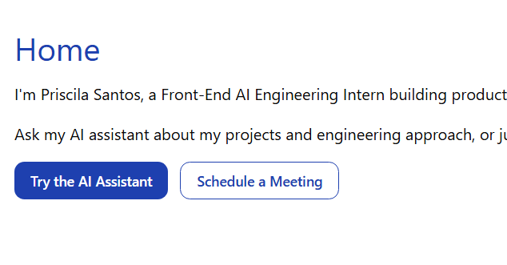
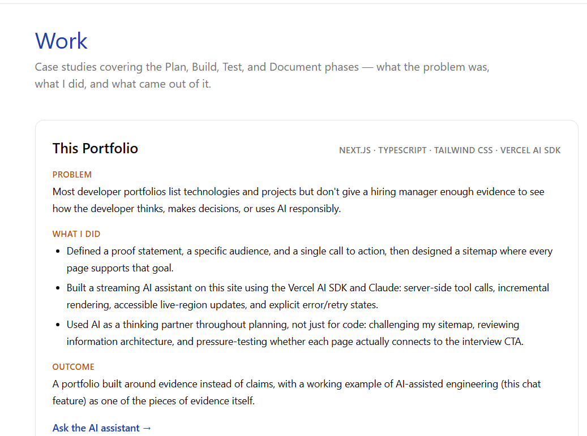
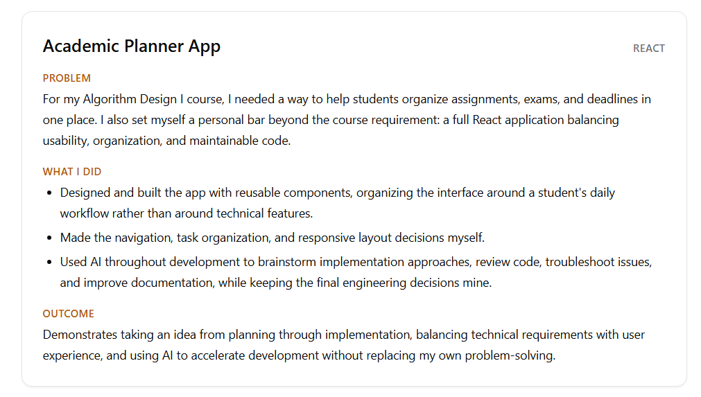
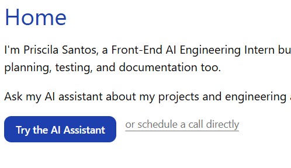
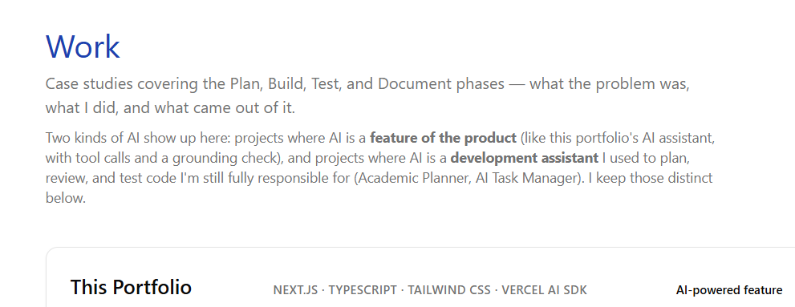
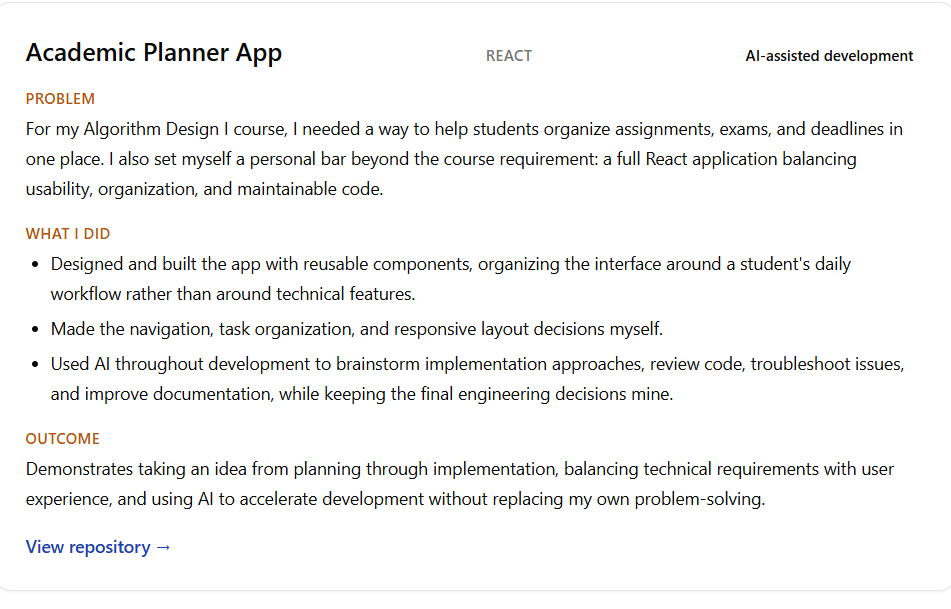

# Feedback Engagement — Proof Statement Validation

**Portfolio:** https://priscila-portfolio.vercel.app/
**Proof statement tested:**
> I'm a front-end AI engineer who builds interactive, accessible web experiences as well as AI-powered applications, using React, TypeScript, and modern web technologies.

**Questions asked to the reviewer:**
1. In 10 seconds, what do you understand that I do?
2. Would you believe I'm good at it? Why?

---

## 1. Reviewer's feedback (summary)

The reviewer is a person in my field who looked at the site cold, without any explanation beyond the proof statement.

**10-second read:** "junior/intern who documents well how she uses AI tools in her workflow."

**Believability:** Partially. The reviewer found the AI-collaboration story credible and well-documented (Problem → What I Did → Outcome, honest AI-assisted framing, accessibility evidence), but did **not** find strong evidence for the "AI-powered applications" half of the proof statement — only one project (the portfolio's own chat) has AI as a shipped product feature; the other two cited projects use AI as a *development* tool (GitHub Copilot), not as a feature of the application itself.

Score given: 6/10 on proof-statement validation. Full raw feedback is preserved in the thread/attachment.

---

## 2. Must-fix vs. Nice-to-have (my sort)

I sorted the reviewer's findings myself rather than treating every note as equally urgent. The sort below is mine, based on which issues directly undermine the proof statement or the site's credibility, versus which are polish.

### Must-fix
| # | Issue | Why it's must-fix |
|---|---|---|
| 1 | Weak/circular evidence for "AI-powered applications" — only the portfolio's own chat qualifies; the other two projects use AI in development, not as a product feature | This is literally half of my proof statement. Without a fix, the claim is unsupported. |
| 2 | Contradiction: the "This Portfolio" case study claims a "single call to action," but Home shows two primary CTAs and other pages add their own | Directly undermines the case study's whole point (that I make and follow deliberate structural decisions) — the exact thing meant to build credibility instead erodes it. |
| 3 | Generic page metadata (`title: "Portfolio"`, `description: "A portfolio site."`) on every page | First real touchpoint (browser tab, shared-link preview) communicated nothing — no name, no specialization. |
| 4 | "Academic Planner App" case study has no repo/demo link | It's the only cited project with zero way to verify the work, unlike the other three. |

### Nice-to-have (acknowledged, not blocking)
- Confirm the `/ai` "preparing a response" state isn't stuck before hydration (needs a manual real-browser check, not just a code read).
- Unify CTA copy ("Try the AI Assistant" vs. "Ask the AI assistant →").
- Add quantifiable outcomes to more case studies (only the 3D Lab currently has real numbers — bundle size, FPS).
- Soften the tension between "engineer" framing and "first-semester intern / Contact page" framing with one context sentence.

I'm treating the nice-to-haves as real but non-blocking: none of them make a claim in my proof statement false or unverifiable the way the four must-fixes do.

---

## 3. How I engaged with the feedback

I did not defend the original copy or push back on the reviewer's read. Where the feedback pointed at something true (the CTA contradiction, the missing link), I changed the artifact rather than the explanation. Where the gap was real but structural (AI-powered vs. AI-assisted), I made the distinction explicit and visible instead of quietly hoping it read as intended.

### Fix 1 — Made the AI-powered vs. AI-assisted split explicit
**File:** `app/work/page.tsx`
**Change:** Added an intro paragraph on the Work page naming the two categories directly, and added an `aiRole` badge (`AI-powered feature` / `AI-assisted development`) to every case study card so the distinction is visible at a glance, not just implied by reading closely.
**Why this and not something else:** The reviewer's point wasn't that I lack the projects — it's that I hadn't labeled which kind of AI involvement each one demonstrates. Adding a badge is honest (it doesn't inflate the AI Task Manager or Academic Planner into something they aren't) and directly closes the "circular evidence" gap by making the one AI-powered-feature project (the portfolio's own chat) unmistakable.

### Fix 2 — Resolved the single-CTA contradiction
**File:** `app/work/page.tsx` (case study copy) and `app/page.tsx` (Home CTAs)
**Change:** Rewrote the "This Portfolio" case study to describe a CTA *ladder* (layered, pointing toward one final action) instead of claiming a single CTA that the site doesn't actually have. On Home, demoted "Schedule a Meeting" from a full button to a secondary text link, so there is one visually primary CTA ("Try the AI Assistant").
**Why this and not something else:** I had two honest options — make the copy match the site, or make the site match the copy. I did both: the copy no longer overclaims, and the Home page now genuinely has a single primary action, which is a stronger fix than just rewording.

### Fix 3 — Replaced generic metadata
**File:** `app/layout.tsx`
**Change:** `title` → "Priscila Santos — Front-End AI Engineering"; `description` → a sentence naming the actual stack and specialization instead of "A portfolio site."
**Why this and not something else:** This was the cheapest, highest-leverage fix — it's the first thing anyone sees in a tab or a shared link, and it cost nothing to get right.

### Fix 4 — Addressed the unverifiable Academic Planner project
**File:** `app/work/page.tsx`
**Change:** [Confirm which path you took and keep only the true one:]
- ( ) Added a real link: `https://github.com/Priscila-Santos/<repo-name>`
- ( ) Made the previously-private repo public and linked it
- ( ) Added an honest note in place of a link: *"Repository is private during course grading; screenshots available on request."*
**Why this and not something else:** The reviewer's point was about verifiability, not project quality. Silently leaving it unlinked keeps the gap; a note is honest if the repo genuinely can't be public yet, but a real link is the stronger fix if it's available.

---

## 4. Evidence (before → after)

> Fill in with the before/after once verified live — screenshots and short GIFs for the thread post.

### Before Feedback

| Home | Work Page | Academic Planner |
|------|--------------|--------|
|  |  |  |
| *Home —  before the feedback* | *Work Page — before the feedback* | *Academic Planner — before the feedback* |

### After Feedback

| Home | Work Page | Academic Planner |
|------|--------------|--------|
|  |  |  |
| *Home —  after the feedback* | *Work Page — after the feedback* | *Academic Planner — after the feedback* |

---

## 5. What I'm not changing (and why)

I'm leaving the "first-semester intern" framing on Contact as-is rather than removing it to sound more senior — the reviewer flagged it as a *tension*, not a falsehood, and removing it would trade honesty for polish. The nice-to-have list stays deferred for the same reason the must-fix list exists: not every valid note is equally urgent, and pretending otherwise would blur the actual priority signal this exercise is supposed to produce.
