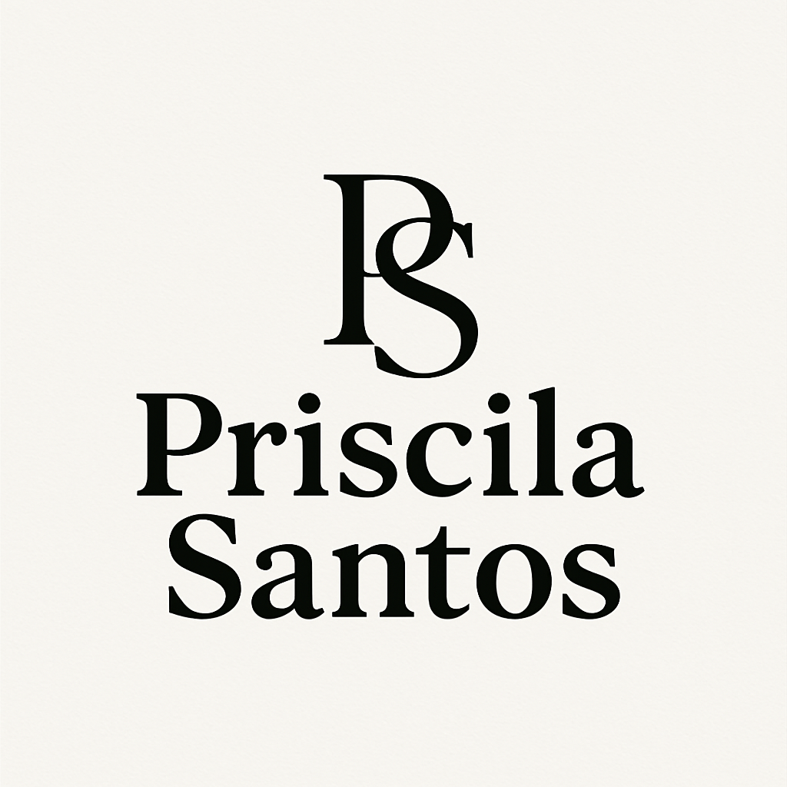
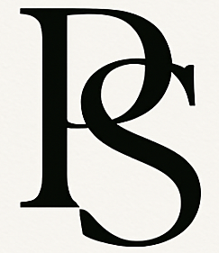

# Priscila Santos — Portfolio Identity Kit

Reference document for consistent visual decisions across the portfolio. Every choice below is sourced from the typography and color specs provided, adapted to a single, defensible system.

---

## 1. Typography

| Role | Font | Weight | CSS var | Used for |
|---|---|---|---|---|
| Display / Hero | **Syne** | 800 (ExtraBold) | `--font-title` | Hero name/slogan, H1 |
| Section titles | **Syne** | 700 (Bold) | `--font-title` | H2/H3, project names |
| Body text | **Inter** | 400 (Regular) | `--font-body` | Paragraphs, About Me, descriptions |
| Code / tags | **Space Mono** | 400 / 700 | `--font-code` | Tech tags (`React`, `Spring Boot`), code snippets |

**Import:**
```css
@import url('https://fonts.googleapis.com/css2?family=Inter:wght@400;500;600&family=Space+Mono:ital,wght@0,400;0,700;1,400&family=Syne:wght@700;800&display=swap');
```

**Core variables:**
```css
:root {
  --font-title: 'Syne', sans-serif;
  --font-body: 'Inter', sans-serif;
  --font-code: 'Space Mono', monospace;

  --weight-regular: 400;
  --weight-medium: 500;
  --weight-semibold: 600;
  --weight-bold: 700;
  --weight-extrabold: 800;

  --fs-display: clamp(2.5rem, 5vw + 1rem, 4.5rem); /* Hero H1 */
  --fs-h1: clamp(2rem, 3vw + 1rem, 3rem);           /* Section titles */
  --fs-h2: clamp(1.5rem, 2vw + 1rem, 2rem);          /* Subtitles */
  --fs-body: clamp(1rem, 0.5vw + 0.8rem, 1.125rem);  /* Paragraphs */
  --fs-small: 0.875rem;                              /* Badges/tags */

  --lh-tight: 1.1;
  --lh-normal: 1.6;
  --tracking-tight: -0.02em;
}
```

**Why this pairing:** Syne's geometric, high-contrast letterforms read as confident and modern in headlines without becoming decorative — it signals design intent. Inter is a neutral, highly legible workhorse for long-form text, which matters because a hiring manager will actually read my case studies. Space Mono marks anything code-related (tech tags, snippets) as visually distinct from prose, reinforcing "engineer" without extra labels.

---

## 2. Color Palette

Two vibrant accents intentionally: a **magenta/rose** ("pop pink") for the primary human-facing CTA (e.g., "View Project"), and a **blue** for technical/dev signifiers (links, tech tags). This separation lets a reader distinguish "action" from "technical metadata" at a glance — a small but real UX decision worth having in my case study.

### Light Mode (default)
| Token | Hex | Use |
|---|---|---|
| `--bg-primary` | `#f8fafc` | Page background |
| `--bg-secondary` | `#f1f5f9` | Card/section backgrounds |
| `--bg-tertiary` | `#e2e8f0` | Borders, dividers |
| `--text-primary` | `#0f172a` | Headings, body text |
| `--text-secondary` | `#475569` | Subtitles, paragraphs |
| `--text-muted` | `#64748b` | Dates, minor details |
| `--color-pop-pink` | `#f43f5e` | Primary CTA, brand accent |
| `--color-pop-pink-hover` | `#e11d48` | CTA hover state |
| `--color-soft-pink` | `#ffe4e6` | Badge/tag backgrounds |
| `--color-blue-accent` | `#2563eb` | Links, tech icons |
| `--color-blue-soft` | `#dbeafe` | Tech tag backgrounds |

### Dark Mode
| Token | Hex | Use |
|---|---|---|
| `--bg-primary` | `#0b0f19` | Page background |
| `--bg-secondary` | `#161e2e` | Card backgrounds |
| `--bg-tertiary` | `#243044` | Borders, dividers |
| `--text-primary` | `#f8fafc` | Headings, body text |
| `--text-secondary` | `#94a3b8` | Subtitles, paragraphs |
| `--text-muted` | `#64748b` | Dates, minor details |
| `--color-pop-pink` | `#fb7185` | Primary CTA, brand accent |
| `--color-pop-pink-hover` | `#f43f5e` | CTA hover state |
| `--color-soft-pink` | `rgba(251,113,133,0.15)` | Badge/tag backgrounds |
| `--color-blue-accent` | `#38bdf8` | Links, tech icons |
| `--color-blue-soft` | `rgba(56,189,248,0.15)` | Tech tag backgrounds |

```css
[data-theme="dark"], body.dark-mode {
  --shadow-card: 0 4px 25px -2px rgba(0, 0, 0, 0.4);
}
:root {
  --shadow-card: 0 4px 20px -2px rgba(15, 23, 42, 0.08);
}
```

**Rule of thumb:** pink = "do something" (CTA, primary action), blue = "this is technical" (links, stack tags), everything else stays neutral slate. If a new element doesn't clearly fit one of those two jobs, it should be neutral — resist adding a third accent color.

---

## 3. Logo & Favicon

- **Full logotype:** `PS-logo.png` — monogram + "Priscila Santos" wordmark in Syne-style serif. Use in the header/nav and footer.
- **Icon/favicon:** `PS-icon.png` — the "PS" monogram alone. Use as the browser favicon and any small-format brand mark (social preview, loading state).
- Both are black-on-off-white; on dark backgrounds, keep them as-is inside a light card/chip rather than recoloring, to avoid distorting the mark.
- Minimum clear space around the monogram: roughly the height of the "P" stroke, on all sides.

--- 

## Logo image

### Primary Logo



### Favicon / Icon



---

## 4. Style Note

Editorial-serif confidence meets systematic engineering precision — Syne headlines and a magenta accent carry the "designer" instinct, while Inter body copy, Space Mono tags, and documented CSS variables carry the "engineer" discipline.
